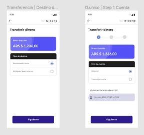
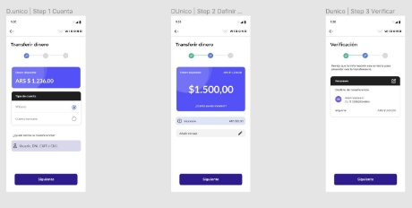
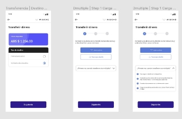
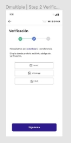
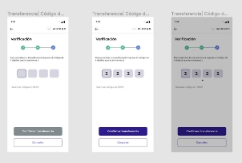
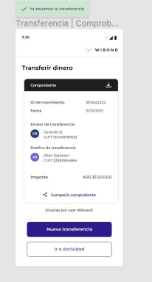

Práctico 1,2,3 - HTML, CSS y JS

OBJETIVO

Realizar una maqueta funcional de un flujo de iniciar sesión y transferencia en mobile.

HISTORIAS DE USUARIO

|**ID**|1|
| - | - |
|**HISTORIA**|Como usuario quiero ver el splash screen por 5 segundos|
|**DESCRIPCIÓN**|Es la primera pantalla de contacto con el usuario, generalmente se carga esto y el sistema por detrás sigue cargando datos para tener toda la información para el usuario.|
|**CRITERIOS DE ACEPTACIÓN**|
1. [HTML] Maquetar la pantalla.

2. [JS] Ver el splash screen por 5 segundos
|
|**SUGERENCIA**||

|**ID**|2|
| - | - |
|**HISTORIA**|Como usuario quiero ver la pantalla para iniciar sesión|
|**DESCRIPCIÓN**|
El usuario debe tener que iniciar sesión para poder identificarlo para el uso de la plataforma.

Todos los usuario tienen un usuario que es su correo y una contraseña.
|
|**CRITERIOS DE**|1\. [HTML] Maquetar la pantalla completa.|

|**ACEPTACIÓN**|
2. [HTML] El campo de contraseña no deben ser “\*” para cada carácter.

3. [HTML] Validar que la contraseña sea mayor a 8 caracteres.

4. [HTML] Todos los botones deben tener un :hover.

5. [JS] Validar que el usuario sea un email, en caso de que no lo sea debemos mostrar un mensaje de error.

6. [JS] El botón de iniciar sesión tiene que estar desactivado hasta que todos los campos estén completos.

7. [JS] Al hacer click en iniciar sesión, debemos almacenar los datos en el localStorage.

8. [JS] Al hacer click en iniciar sesión, debemos redirigirlo a una pantalla para seleccionar el tipo de transferencia.
|
| - | :- |
|**IMÁGENES**||

|**ID**|3|
| - | - |
|**HISTORIA**|Como usuario quiero seleccionar el tipo de transferencia a realizar|
|**DESCRIPCIÓN**|Es una pantalla para seleccionar si vamos a hacer una transferencia simple o múltiple.|
|**CRITERIOS DE ACEPTACIÓN**|
9. [HTML] Maquetar la pantalla completa.

10. [JS] El botón de “siguiente” tiene que estar desactivado hasta que se haya seleccionado un tipo de destino.
|

|**IMÁGENES**||
| - | - |

|**ID**|4|
| - | - |
|**HISTORIA**|Como usuario quiero ver las pantallas de transferencia única|
|**DESCRIPCIÓN**|
Es un flujo para realizar una transferencia hacia una billetera Wibond

o hacia una cuenta bancaria.
|
|**CRITERIOS DE ACEPTACIÓN**|
1. [HTML] Maquetar las tres pantallas.

2. [JS] Al hacer click en Wibond o Cuenta bancaria debemos mostrar diferente el box de abajo.

3. [HTML] En la segunda foto, el $1500 es un input para transferir. Se puede poner un input normal.

4. [JS] Los botones de siguiente siempre tiene que estar desactivados hasta que se completen todos los datos de cada paso.

5. [JS] Calcular el impuesto automáticamente cuando se van ingresando los valores en el input.

6. [JS] Validar que no se pueda hacer una transferencia mayor al saldo disponible.
|
|**IMÁGENES**||

|**ID**|5|
| - | - |
|**HISTORIA**|Como usuario quiero ver las pantallas de transferencia múltiple|
|**DESCRIPCIÓN**|Es el flujo para realizar múltiples transferencias por un archivo.|
|**CRITERIOS DE ACEPTACIÓN**|
1. [HTML] Maquetar las 3 pantallas.

2. [JS] Poder subir un archivo csv.

3. [JS] Los botones de siguiente siempre tiene que estar desactivados hasta que se completen todos los datos de cada paso.

4. [JS] Calcular el impuesto automáticamente cuando se van ingresando los valores en el input.

5. [JS] Validar que no se pueda hacer una transferencia mayor al saldo disponible.
|
|**IMÁGENES**||

|**ID**|6|
| - | - |
|**HISTORIA**|Como usuario quiero seleccionar el método para que me envíen el código de verificación|
|**DESCRIPCIÓN**|El usuario puede seleccionar el método de envío del código de verificación para realizar la transferencia.|
|**CRITERIOS DE ACEPTACIÓN**|
1. [HTML] Maquetar la pantalla.

2. [JS] El botón de desactivar debe estar desactivado hasta que se seleccionó un método de envio.
|

|**IMÁGENES**||
| - | - |

|**ID**|7|
| - | - |
|**HISTORIA**|Como usuario quiero cargar un código de verificación para confirmar una/s transferencia|
|**DESCRIPCIÓN**|El usuario debe ingresar un código de cuatro dígitos numéricos para confirmar la transferencia.|
|**CRITERIOS DE ACEPTACIÓN**|
1. [HTML] Maquetar la pantalla.

2. [HTML] Solo se debe poder ingresar un dígito numérico por input.

3. [JS] Luego de ingresar los 4 dígitos se debe comparar con un código en localStorage para verificar que sea el correcto.

4. [JS] Luego de ingresar un dígito, el curso se debe mover al input de la derecha.
|
|**IMÁGENES**||

|**ID**|8|
| - | - |
|**HISTORIA**|Como usuario quiero ver un resumen de la transferencia exitosa que realicé|
|**DESCRIPCIÓN**|Mostrar un resumen luego de hacerse confirmarse la transferencia.|

|**CRITERIOS DE ACEPTACIÓN**|
1. [HTML] Maquetar la pantalla.

2. [HTML] El botón de Compartir que sea un link a Whatsapp con un texto con el resumen de la transferencia.

3. [HTML] El botón de Nueva transferencia debe ir hacia la pantalla para seleccionar entre transferencia simple o múltiple.
|
| :- | - |
|**IMÁGENES**||

RECURSOS EN FIGMA

[https://www.figma.com/file/jiklKOelGGZYuOsUi9QxHT/Wibond-desafio?type=design&node-i d=50%3A2078&mode=dev&t=M2Z88tM2Nughuxwq-1](https://www.figma.com/file/jiklKOelGGZYuOsUi9QxHT/Wibond-desafio?type=design&node-id=50%3A2078&mode=dev&t=M2Z88tM2Nughuxwq-1)
